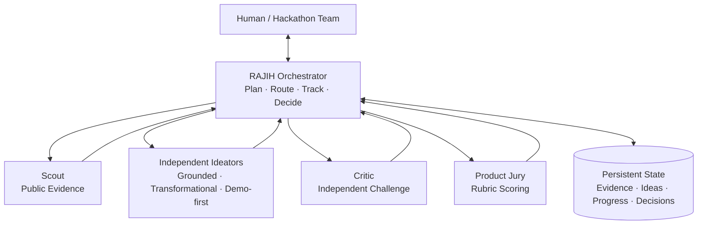

# RAJIH Engine

**Evidence-grounded multi-agent ideation for hackathon teams.**

RAJIH Engine provides a small, inspectable runtime for turning a challenge brief into independent candidate ideas, structured criticism, evidence annotations, and a recorded decision. It is designed to work with OpenCode, Codex, or Claude Code without hard-coding a model provider.

> **Status:** Engineering alpha `v0.2.0`. The local runtime, four direct provider adapters, command-line interface, persistence layer, routing logic, and automated tests work. Live API calls require the user's own account, key, model access, and budget.

## What is included

- A Python command-line application.
- Direct standalone execution through OpenAI, Anthropic, Gemini, or DeepSeek.
- Durable JSON and Markdown run records.
- An uncertainty-aware routing layer.
- Isolated ideator, scout, critic, and jury agent definitions.
- Setup guides for OpenCode, Codex, and Claude Code.
- Automated tests and GitHub Actions CI.
- Editable Mermaid architecture and workflow diagrams.

This public engineering edition intentionally excludes private research plans, experimental hypotheses, paper drafts, literature notes, and unpublished evaluation material.

## Architecture



Specialists return bounded outputs to the orchestrator. First-round ideators remain isolated from one another, and the orchestrator is the only component allowed to merge shared state.

See [Architecture](docs/architecture.md) and [Diagrams](docs/diagrams/README.md).

## Quick start

Python 3.11 or newer is required.

```powershell
py -m venv .venv
.venv\Scripts\Activate.ps1
python -m pip install -e .
rajih demo examples/brief.json
rajih status
```

The demo writes its output under `.rajih/runs/<run-id>/`:

- `state.json`: authoritative machine-readable state.
- `brief.md`: challenge and constraints.
- `ideas.md`: candidates and lineage.
- `decisions.md`: decisions and rationale.
- `progress.md`: stage and completed work.

The demo does not call an LLM or verify external claims.

## Standalone model run

Set your API key in the current process without saving it in the repository:

```powershell
$env:OPENAI_API_KEY = Read-Host "OpenAI API key"
rajih run examples/brief.json --provider openai --model "YOUR_MODEL_ID" --web-search
```

`--provider` accepts `openai`, `anthropic`, `gemini`, or `deepseek`. The `--web-search` option is currently available only with OpenAI; without it, RAJIH skips external evidence collection. OpenAI and Gemini requests use `store: false`; provider account and retention settings still apply.

One provider can run every role, or roles can use different providers:

```powershell
rajih run examples/brief.json `
  --provider openai --model "OPENAI_MODEL_ID" `
  --ideator-provider deepseek --ideator-model "DEEPSEEK_MODEL_ID" `
  --critic-provider anthropic --critic-model "ANTHROPIC_MODEL_ID" `
  --scout-provider gemini --scout-model "GEMINI_MODEL_ID"
```

The command runs three isolated ideation perspectives, critiques every candidate, scores the finalists, and saves the complete run. If the top candidates are close, it stops at `human_gate`:

```powershell
rajih status <run-id>
rajih choose <run-id> IDEA-02 --reason "Best fit for our team"
rajih validate <run-id>
```

See [Direct provider usage](docs/guides/direct-providers.md). OpenCode, Codex, and Claude Code remain optional agent-host integrations:

- [OpenCode](docs/guides/opencode.md)
- [Codex](docs/guides/codex.md)
- [Claude Code](docs/guides/claude-code.md)

## Commands

```text
rajih init <brief.json>       Create a new run
rajih demo <brief.json>       Run the deterministic offline demo
rajih run <brief.json>        Run directly through the OpenAI API
rajih status [run-id]         List runs or inspect one run
rajih choose <run-id> <idea>  Resolve a close-result human gate
rajih validate <run-id>       Validate state invariants
```

## Model policy

RAJIH does not pin model names. Direct adapters require `--model`, a role-specific model flag, or the selected provider's model environment variable. OpenCode, Codex, and Claude Code use the model configured in their runtime. Every role's provider and model identifier are saved with direct runs.

Additional provider integrations can implement the `AgentBackend` protocol in `src/rajih/engine.py`. Keep credentials in environment variables and never commit `.env` or `.rajih/`.

## Verification

```powershell
python -m unittest discover -s tests -v
rajih demo examples/brief.json
rajih validate <run-id>
```

## Security and privacy

- Review provider terms before sending private team or hackathon material.
- Do not store credentials inside briefs, prompts, or run logs.
- Treat `.rajih/` as potentially confidential.
- External factual claims should retain a source URL and access metadata.
- A model score is not proof of novelty or correctness.

See [Security Policy](SECURITY.md) and [Data Governance](docs/data-governance.md).

## Rights

RAJIH is **source-available, not open source**. The license permits viewing, running, studying, and limited private modification while restricting modified redistribution, rebranding, and commercial service use without written permission.

Copyright © 2026 Sultan Alfaifi. See [LICENSE](LICENSE) and [NOTICE.md](NOTICE.md).

## Independence

RAJIH is an independent project. OpenCode, Codex, Claude, OpenAI, and Anthropic are trademarks of their respective owners. Integration files do not imply sponsorship or endorsement.
