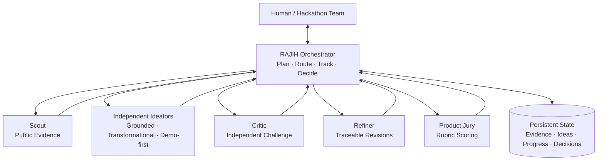

# RAJIH Engine

**Evidence-grounded multi-agent ideation for hackathon teams.**

RAJIH Engine provides a small, inspectable runtime for turning a challenge brief into independent candidate ideas, structured criticism, evidence annotations, and a recorded decision. It is designed to work with OpenCode, Codex, or Claude Code without hard-coding a model provider.

> **Status:** Engineering alpha `v0.4.1`. The Full Evidence Loop, Codex subscription adapter, five direct API adapters, command-line interface, persistence layer, routing logic, and automated tests work. Provider usage remains subject to the selected service's account limits and terms.

## What is included

- A Python command-line application.
- Official ChatGPT subscription execution through the locally authenticated Codex CLI.
- Direct API execution through OpenRouter, OpenAI, Anthropic, Gemini, or DeepSeek.
- Durable JSON and Markdown run records.
- An uncertainty-aware routing layer.
- Traceable idea revisions linked with `parent_id`.
- Candidate-specific verification before evidence-informed jury scoring.
- Isolated ideator, scout, critic, and jury agent definitions.
- Setup guides for OpenCode, Codex, and Claude Code.
- Automated tests and GitHub Actions CI.
- Editable Mermaid architecture and workflow diagrams.

This public engineering edition intentionally excludes private research plans, experimental hypotheses, paper drafts, literature notes, and unpublished evaluation material.

## Architecture



Specialists return bounded outputs to the orchestrator. First-round ideators remain isolated from one another, and the orchestrator is the only component allowed to merge shared state. The live pipeline now executes `UNDERSTAND → RESEARCH → DIVERGE → CRITIQUE → REFINE → VERIFY → CONVERGE → HUMAN_GATE/DECIDE → DONE`; incomplete briefs stop at `CLARIFY_BRIEF`.

See [Architecture](docs/architecture.md) and [Diagrams](docs/diagrams/README.md).

## Research foundations

RAJIH's architecture is informed by published and preprint work on central orchestration, structured multi-agent ideation, sparse routing, failure analysis, idea lineage, human steering, debate dynamics, novelty-judgment limits, and the broader LLM-assisted ideation lifecycle.

The sources support individual design choices; they do not independently validate the complete RAJIH system or prove that it outperforms other workflows for hackathons. See the full [research foundations and architecture-to-source map](docs/research-foundations.md).

Private hypotheses, experiment designs, benchmark data, unpublished results, and paper drafts remain outside this public engineering repository.

## Quick start

Python 3.11 or newer is required.

```powershell
py -m venv .venv
.venv\Scripts\Activate.ps1
python -m pip install -e .
rajih demo examples/brief.json
rajih status
```

The demo writes its output under `.rajih/runs/<run-id>/`:

- `state.json`: authoritative machine-readable state.
- `brief.md`: challenge and constraints.
- `ideas.md`: candidates and lineage.
- `decisions.md`: decisions and rationale.
- `progress.md`: stage and completed work.

The demo does not call an LLM or verify external claims.

## Run with your ChatGPT subscription

This is the default and does not require an OpenAI API key. RAJIH invokes the official Codex CLI, which reuses its saved ChatGPT login:

```powershell
codex login
codex login status
rajih run examples/brief.json --provider codex
```

This uses your Codex/ChatGPT subscription allowance rather than OpenAI API billing. It is not unlimited: plan availability, usage limits, and reset windows still apply. RAJIH never reads or copies the cached Codex credential. Each role runs through an ephemeral, read-only `codex exec` process with a required JSON output schema.

Add `--web-search` for Scout web research, or `--model "MODEL_ID"` only when you intentionally want to override your configured Codex model.

## Run with OpenRouter

OpenRouter is a separate API service and requires its own key. Its usage is not included with a ChatGPT subscription and may incur OpenRouter charges:

```powershell
$env:OPENROUTER_API_KEY = Read-Host "OpenRouter API key"
rajih run examples/brief.json --provider openrouter --model "OPENROUTER_MODEL_ID"
```

Choose an OpenRouter model that supports structured outputs. `--web-search` requests OpenRouter's web plugin and can add usage or cost.

## Other direct API providers

Set your API key in the current process without saving it in the repository:

```powershell
$env:OPENAI_API_KEY = Read-Host "OpenAI API key"
rajih run examples/brief.json --provider openai --model "YOUR_MODEL_ID" --web-search
```

`--provider` accepts `codex`, `openrouter`, `openai`, `anthropic`, `gemini`, or `deepseek`. Web search is supported for Scout with Codex, OpenRouter, and OpenAI. Without it, RAJIH skips external evidence collection and routes the final choice to the human because candidate evidence is incomplete. OpenAI and Gemini requests use `store: false`; provider account and retention settings still apply.

One provider can run every role, or roles can use different providers:

```powershell
rajih run examples/brief.json `
  --provider openai --model "OPENAI_MODEL_ID" `
  --ideator-provider deepseek --ideator-model "DEEPSEEK_MODEL_ID" `
  --critic-provider anthropic --critic-model "ANTHROPIC_MODEL_ID" `
  --scout-provider gemini --scout-model "GEMINI_MODEL_ID"
```

The command runs three isolated ideation perspectives, critiques and refines each candidate, verifies each revision separately, then gives the Jury the candidate's evidence. It stops at `human_gate` when finalists are close or candidate-specific evidence is missing:

```powershell
rajih status <run-id>
rajih choose <run-id> IDEA-02 --reason "Best fit for our team"
rajih validate <run-id>
```

See [Direct provider usage](docs/guides/direct-providers.md). OpenCode, Codex, and Claude Code remain optional agent-host integrations:

- [OpenCode](docs/guides/opencode.md)
- [Codex](docs/guides/codex.md)
- [Claude Code](docs/guides/claude-code.md)

## Commands

```text
rajih init <brief.json>       Create a new run
rajih demo <brief.json>       Run the deterministic offline demo
rajih run <brief.json>        Run through Codex subscription or a selected API
rajih status [run-id]         List runs or inspect one run
rajih choose <run-id> <idea>  Resolve a close-result human gate
rajih validate <run-id>       Validate state invariants
```

## Model policy

RAJIH does not pin model names. The `codex` provider can inherit the model configured in Codex; direct API adapters require `--model`, a role-specific model flag, or the selected provider's model environment variable. OpenCode and Claude Code use the model configured in their runtime. Every role's provider and model identifier are saved with direct runs.

Additional provider integrations can implement the `AgentBackend` protocol in `src/rajih/engine.py`. Keep credentials in environment variables and never commit `.env` or `.rajih/`.

## Verification

```powershell
python -m unittest discover -s tests -v
rajih demo examples/brief.json
rajih validate <run-id>
```

## Security and privacy

- Review provider terms before sending private team or hackathon material.
- Do not store credentials inside briefs, prompts, or run logs.
- Treat `.rajih/` as potentially confidential.
- External factual claims should retain a source URL and access metadata.
- A model score is not proof of novelty or correctness.

See [Security Policy](SECURITY.md) and [Data Governance](docs/data-governance.md).

## Rights

RAJIH is **source-available, not open source**. The license permits viewing, running, studying, and limited private modification while restricting modified redistribution, rebranding, and commercial service use without written permission.

Copyright © 2026 Sultan Alfaifi. See [LICENSE](LICENSE) and [NOTICE.md](NOTICE.md).

## Independence

RAJIH is an independent project. OpenCode, Codex, Claude, OpenAI, and Anthropic are trademarks of their respective owners. Integration files do not imply sponsorship or endorsement.
