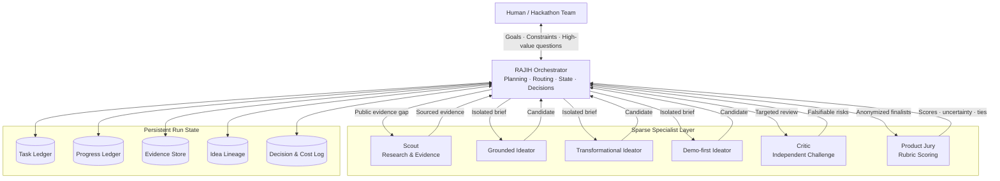

# RAJIH system architecture

RAJIH uses a central orchestrator and sparse specialist invocation. Specialists return bounded outputs to the orchestrator and do not share an open group chat.

The product jury supplies a structured evaluation signal. It does not replace external prior-art verification or the team's final judgment.

