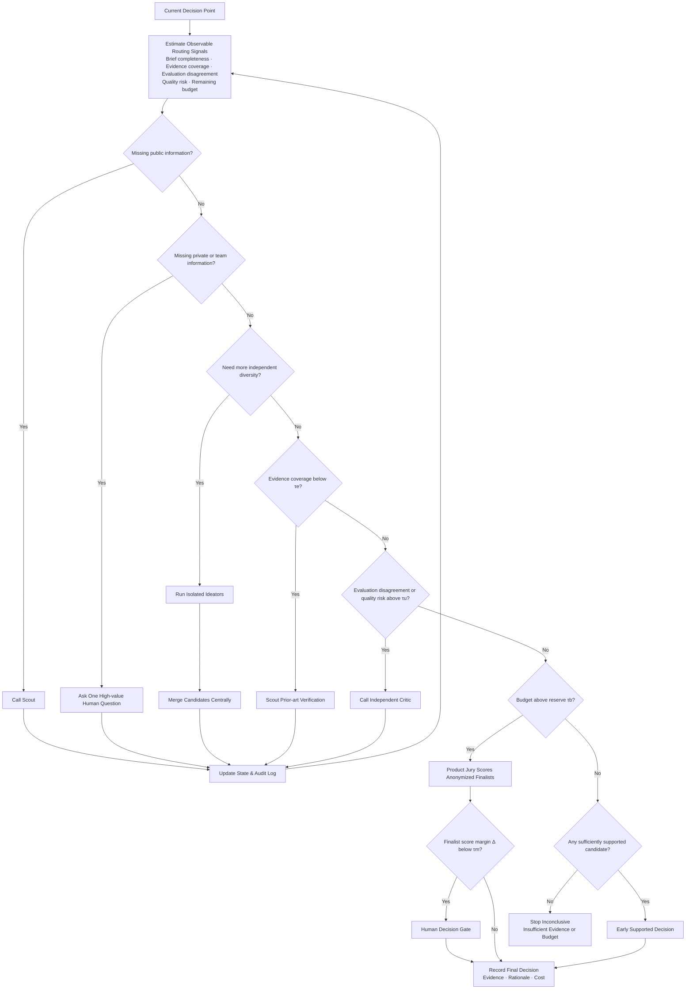

# Uncertainty-aware routing

This policy decides whether to collect public evidence, ask the human, expand diversity, critique, evaluate, decide, or stop inconclusively.

Implementation status: `v0.1.0` implements intake missingness, evidence coverage, and finalist-margin routing. Evaluation-disagreement and budget-reserve enforcement remain proposed extensions.

The symbols `τe`, `τu`, `τb`, and `τm` are tunable thresholds. Record selected values with each run when these extensions are implemented.
