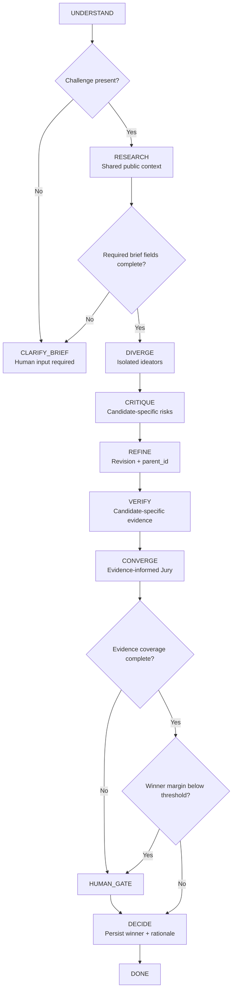

# Uncertainty-aware routing

This policy decides whether to collect public evidence, ask the human, expand diversity, critique, evaluate, decide, or stop inconclusively.

Implementation status: `v0.4.0` implements intake missingness, candidate-specific evidence coverage, finalist-margin routing, and an auditable route log. Evaluation-disagreement and budget-reserve enforcement are not implemented.

The finalist margin threshold is configurable in the router. Evidence coverage is deliberately conservative: every finalist must have at least one candidate-specific evidence record for automatic selection. These are routing heuristics, not calibrated statistical uncertainty.
