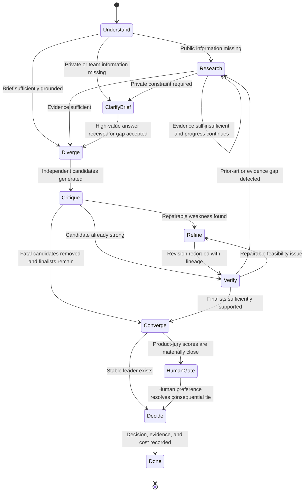

# Workflow and state machine

The workflow can return to evidence collection or refinement. Brief clarification and the final human decision gate are distinct states.

The implementation must also enforce bounded retries and stall detection. If required evidence remains insufficient, the run ends inconclusively instead of manufacturing a winner.

