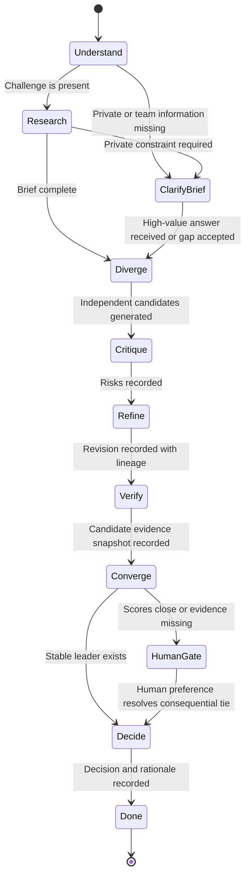

# Workflow and state machine

Version 0.4 executes this bounded workflow. Brief clarification and the final human decision gate are distinct states.

The route log records every transition. Missing candidate evidence forces a human gate instead of manufacturing an automatically supported winner. Retry and stall policies remain provider/runtime concerns in this alpha.

